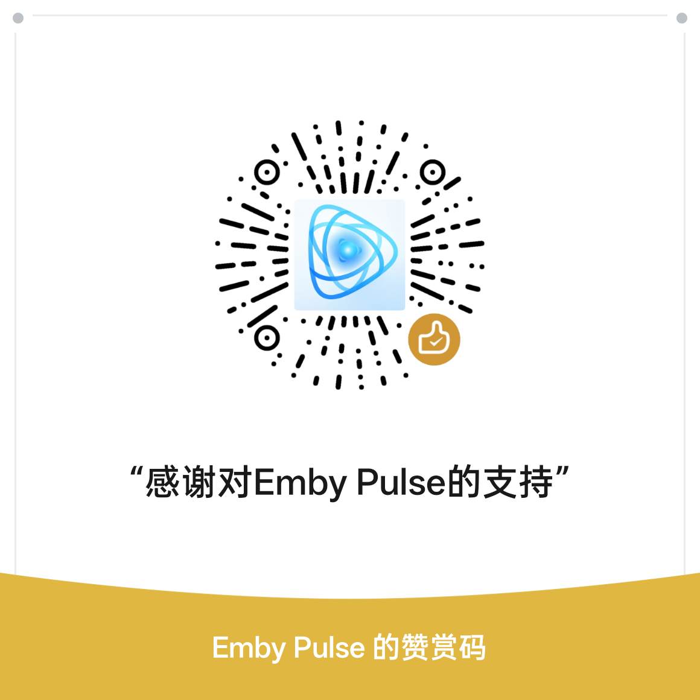

# 🎬 EmbyPulse（映迹）

<div align="center">
  

  <h3>Emby 服务器的高级伴侣：数据洞察、全能管理与下载自动化助手</h3>

  <a href="https://t.me/Emby_Pulse">
    
  </a>
  <br/>
  <p align="center">
    <a href="#-亮点速览"></a>
    <a href="#-界面预览"></a>
    <a href="#-核心功能特性全览"></a>
    <a href="#-快速部署"></a>
    <a href="#️-配置说明"></a>
    <a href="#-常见问题-faq"></a>
    <a href="#-赞赏支持"></a>
    <a href="#-许可证与开源协议"></a>
  </p>
</div>

## 📖 项目简介

EmbyPulse（映迹）是专为 Emby 服主打造的现代化“第二控制台”。它不仅提供了极致的数据可视化大盘，还深度集成了用户管理、追剧日历、缺集自动补货、求片流转及媒体报告生成等核心运维功能。

核心革新：本系统独家支持“API 穿透”与“数据库直读”双擎路由。这意味着您无需强制挂载 Emby 的数据库文件，仅凭 API Key 即可点亮全站统计，完美适配极空间、群晖、云服务器等各种复杂部署环境。

<p align="center">
  <a href="#-亮点速览"></a>
  <a href="#-界面预览"></a>
  <a href="#-核心功能特性全览"></a>
  <a href="#-快速部署"></a>
  <a href="#️-配置说明"></a>
  <a href="#-常见问题-faq"></a>
  <a href="#-赞赏支持"></a>
  <a href="#-许可证与开源协议"></a>
</p>

## ⭐ 亮点速览

- 双擎数据路由：API 模式 / SQLite 模式一键切换，部署环境更自由
- 全面运维面板：播放统计、用户管理、请求系统、任务与缺集全链路
- 自动化闭环：缺集补货 + 求片流转 + 入库反馈一气呵成
- 视觉化报表：日报、周报、月报、年度总结一键生成长图
- 机器人协同：Telegram 交互、推送与实时告警

## 🖼️ 界面预览

<div align="center">
  
  
  
  
  
</div>

## ✨ 核心功能特性全览

### 📊 1. 全景仪表盘（Dashboard）

- 实时监控：秒级同步当前并发播放人数、客户端类型、IP 地址及转码实时负荷。
- 资源概览：直观展示电影、剧集、单集总数，以及总播放次数、累计时长和活跃用户数。
- 趋势分析：集成 ECharts 动态图表，支持按天、周、月统计服务器播放热度变化走势。

### 🔍 2. 缺集管理（Gap Management）—— 强迫症福音

- 全库扫描：智能比对 Emby 现有剧集与 TMDB 全量数据，精准定位已上线但库内缺失的集数。
- MoviePilot 联动：一键调用 MP 搜索接口，支持根据库内已有版本自动匹配 4K / 1080P / HDR 等基因配型。
- 底层下载截胡：推送到 MP 下载整季包时，系统自动切入 qBittorrent / Transmission，物理切除非必要文件，实现“只下载缺的那几集”。
- 状态心跳同步：采用焦点唤醒机制，入库后前端数据零延迟自动核销变色。

### 📅 3. 追剧日历（TV Calendar）

- 全球排期：自动同步本周全球热播剧集更新时间。
- 红绿灯状态：🟢 已入库点击直达 Emby 播放；🔴 缺失集数点击自动复制搜索指令。

### 🎬 4. 求片系统（Request Center）

- 用户求片：支持用户提交电影、剧集、季度等求片请求，统一流转到后台处理。
- 状态追踪：支持待处理、已下载、已入库、已拒绝等完整状态链路。
- 自动联动：媒体一旦成功入库，可自动完成对应求片工单闭环。
- 机器人协同：支持通过 Telegram 等渠道触发求片反馈与处理提醒。

### 👤 5. 用户中心（User Center）

- 账号信息：集中展示用户基础资料、到期时间、备注等关键信息。
- 权限与期限管理：支持账号续期、到期控制、状态管理与生命周期维护。
- 行为回看：结合统计系统查看用户活跃度、观影偏好与使用趋势。
- 统一入口：将用户、邀请、求片、统计等能力收拢到一个面板中管理。

### 🕵️ 6. 数据洞察（Insights）

- 用户画像：分析用户习惯，解锁“深夜修仙”“带薪观影”“全平台制霸”等趣味成就勋章。
- 入驻溯源：直接读取 Emby 官方 API 注册时间，精准还原用户入驻服务器的真实天数。
- 画质审计：盘点媒体库 4K、HDR、杜比视界占比；自动筛选低画质资源（SD / 480P），方便服主进行洗版优化。

### 🎨 7. 映迹工坊（Report Generator）

- 多维报表：自动生成日报、周报、月报及年度总结。
- 网易云风格：内置黑金、赛博、极光、落日等精美视觉主题，支持一键生成长图。
- 社群互动：支持将报表长图自动推送到关联的 Telegram 频道。

### 🎟️ 8. 用户与邀请系统

- 邀请注册：支持生成带有效期的邀请链接，如 7 天、30 天、永久。
- 自助注册页：用户可通过邀请链接自助建号，无需管理员干预。
- 过期管理：支持账号自动到期锁定、批量续期及强制重置密码。

### 🤖 9. Telegram 机器人助理

- 实时推送：入库自动发送精美海报磁贴，播放 / 停止状态实时反馈。
- 防御引擎：毫秒级识别并拦截黑名单客户端，保护服务器资源。
- 便捷交互：支持 `/search` 搜片、`/stats` 数据盘点、`/check` 系统诊断。

### 🛠️ 10. 系统运维

- 任务管理：可视化管理 Emby 所有计划任务，支持手动触发与执行状态监控。
- 智能缓存：前端自定义缓存策略，兼顾响应速度与数据新鲜度。

## 🚀 快速部署

### Docker Compose（推荐）

```yaml
version: '3.8'
services:
  emby-pulse:
    image: zeyu8023/emby-stats:latest
    container_name: emby-pulse
    restart: unless-stopped
    network_mode: host
    volumes:
      - ./config:/app/config
      - /path/to/emby/data:/emby-data # API 模式下可不挂载数据库
    environment:
      - TZ=Asia/Shanghai
      - DB_PATH=/emby-data/playback_reporting.db #API模式下可以不写，本地模式必填
      #重要！必填，否则无法登录！账号密码为你emby管理员账号密码
     - EMBY_HOST=http://127.0.0.1:8096
      #选填，后续可以前往后台设置中添加
     - EMBY_API_KEY=xxxxxxxxxxxxxxxxxxxxx
```

## ⚙️ 配置说明

以下为部署后建议优先检查的核心配置项：

### Emby 基础配置

- `emby_host`：Emby 服务器地址，例如 `http://127.0.0.1:8096`
- `emby_api_key`：Emby 后台生成的 API Key
- `webhook_token`：Webhook 安全校验令牌，需与 Emby Webhook 地址中的 `token` 保持一致
- `emby_public_url`：对外访问 Emby 的公网地址，用于生成跳转链接

### 播放统计配置

- `playback_data_mode`：播放数据模式，支持 `sqlite` 或 `api`
- `DB_PATH`：本地模式下 Playback Reporting 数据库文件路径
- `hidden_users`：需要在大盘中隐藏的用户 ID 列表

说明：
- `sqlite` 模式直接读取数据库文件，性能更高，适合本地 Docker 挂载场景
- `api` 模式通过 Emby 插件接口穿透查询，部署最轻量，适合无法挂载数据库的环境

### Telegram 配置

- `tg_bot_token`：Telegram Bot Token
- `tg_chat_id`：接收主动通知的目标聊天 ID
- `proxy_url`：Telegram 网络代理，可选

支持能力：
- 播放开始 / 停止推送
- 入库通知推送
- 报表推送
- 机器人指令交互

### 企业微信配置

- `wecom_corpid`：企业 ID
- `wecom_corpsecret`：应用 Secret
- `wecom_agentid`：应用 AgentId
- `wecom_touser`：默认推送目标，通常可填 `@all`
- `wecom_proxy_url`：企业微信 API 地址，默认 `https://qyapi.weixin.qq.com`

支持能力：
- 文本与图文通知
- 自定义菜单
- 播放与入库事件推送

### MoviePilot 配置

- `moviepilot_url`：MoviePilot 服务地址
- `moviepilot_token`：MoviePilot API Token

支持能力：
- 缺集搜索
- 一键下发下载任务
- 与缺集管理联动完成补货流程

### 下载器截胡配置

当前支持：
- qBittorrent
- Transmission

常用配置项：
- `client_type`：下载器类型
- `client_url`：下载器地址，例如 `http://127.0.0.1:8080`
- `client_user`：下载器账号
- `client_pass`：下载器密码

支持能力：
- 季包推送后自动锁定下载任务
- 根据目标集数筛出 wanted 文件
- 自动剔除非目标集文件，实现精准补集

## ❓ 常见问题 FAQ

### Q: 是否必须安装 Playback Reporting 插件？

A: 是的。无论使用本地模式还是 API 模式，Emby 都必须安装此官方插件以生成历史播放流水。

### Q: API 模式和本地模式有什么区别？

A:

- 本地模式：直接读取数据库文件，性能最高，适合能挂载目录的 Docker 环境。
- API 模式：通过 API 穿透查询，部署最简单，适合极空间、远程云服等无法直接映射文件的环境。

### Q: 为什么我的“入驻天数”显示不准确？

A: 系统默认会去请求 Emby 官方账号的真实注册时间。如果该账号是早期手动导入的，可能存在偏差；您可以前往 Emby 后台 -> 用户设置中核实。

### Q: 如何开启“缺集管理”的截胡功能？

A: 在系统设置 -> 缺集配置中填写您的 qBittorrent 或 Transmission 地址、账号及密码即可开启。

### Q: 搜索框为什么会默认填充我的管理员名字？

A: 这是浏览器的自动填充策略。本项目已在最新版本中加入了 `autocomplete="off"` 防填充伪装，建议更新至最新镜像。

## ☕ 赞赏支持

如果您觉得 EmbyPulse 好用，欢迎赞赏支持作者的持续迭代！

<div align="center">
  

  <sub>（扫码赞赏，请备注您的 Telegram ID）</sub>
</div>

## 📄 许可证与开源协议

本项目基于 MIT 许可证开源，但必须遵守以下附加条款：

- 强制开源：任何基于本项目进行的二次开发、修改或衍生作品，必须保持开源，并使用同样的协议发布。
- 保留版权：修改后的作品必须在显著位置保留原项目 EmbyPulse（映迹）的版权声明及仓库链接。
- 商业禁令：严禁将本项目及其修改版进行闭源封装、捆绑销售或任何形式的非法盈利。

<div align="center">
  <sub>Designed & Developed by EmbyPulse Team</sub>
</div>
